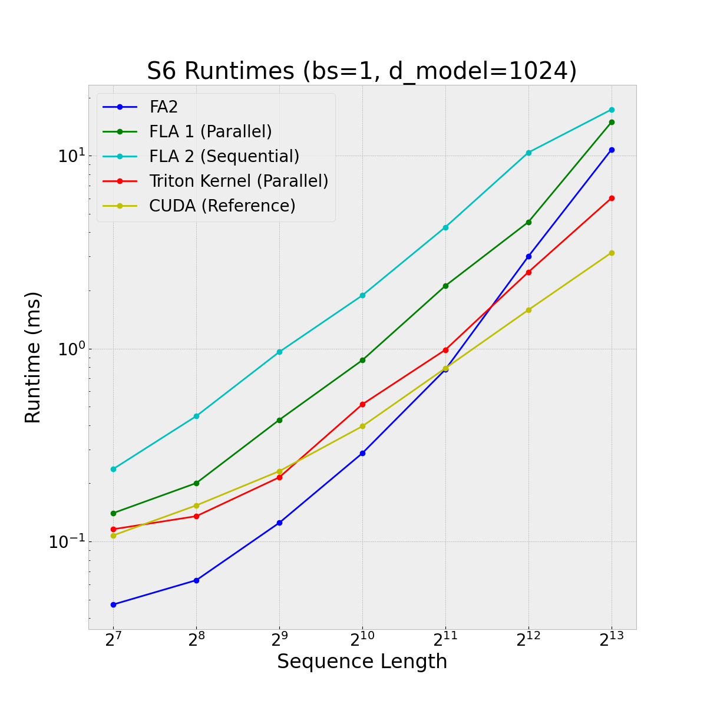

# Mamba - PyTorch 

This is a PyTorch & Triton implementation of Mamba and the Selective Scan (S6) kernel from [Mamba: Linear-Time Sequence Modeling with Selective State Spaces](https://arxiv.org/abs/2312.00752). The kernel is slower than the author-provided kernel, but it is the fastest Triton kernel I know of :)

# Benchmarks

Forward + Backward comparison against Flash Attention V2 in PyTorch, reference CUDA kernel from [state-spaces/mamba](https://github.com/state-spaces/mamba) and two other Triton kernels from [mamba-triton](https://github.com/sustcsonglin/mamba-triton/tree/master):


Forward + Backward comparison against the reference CUDA kernel:


# Install

```bash
git clone https://github.com/fattorib/hawk-pytorch
cd hawk-pytorch
pip install -e .
```

# Usage

```python
import torch
from mamba import MambaConfig, MambaModel

config = MambaConfig(
    vocab_size=32000,
    hidden_size=512,
    intermediate_size=1024,
    state_size=16,
    num_hidden_layers=8,
    dt_rank=64,
)


model = MambaModel(config, use_cache=False)

model.to("cuda")

x = torch.randint(size=(1, 2048), low=1, high=32000, device="cuda:0")
with torch.autocast(device_type="cuda", dtype=torch.bfloat16):
    loss = model(x, x)
loss.backward()
```

# Citations

```bibtex
@misc{gu2024mambalineartimesequencemodeling,
      title={Mamba: Linear-Time Sequence Modeling with Selective State Spaces}, 
      author={Albert Gu and Tri Dao},
      year={2024},
      eprint={2312.00752},
      archivePrefix={arXiv},
      primaryClass={cs.LG},
      url={https://arxiv.org/abs/2312.00752}, 
}
```